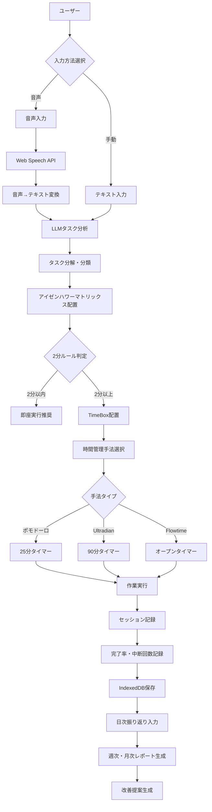
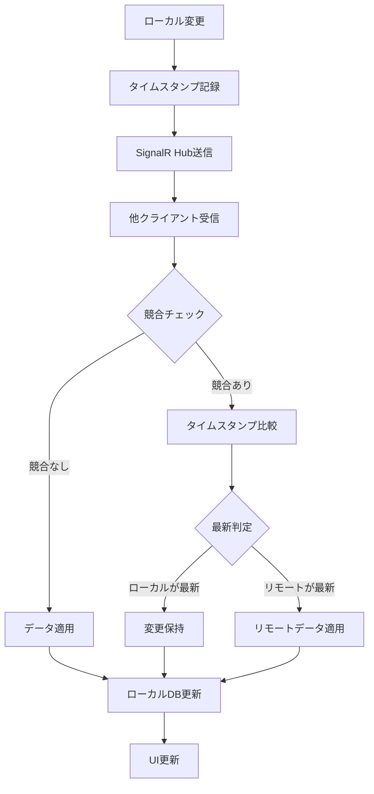

# BokuNoTodo - 包括的仕様書

**作成日**: 2025-09-15
**バージョン**: 2.0
**プロジェクト**: BokuNoTodo

---

## プロジェクト概要

### 目的
シンプルでありながら、AIの力を借りて生産性を最大化するTODOアプリ。複雑な機能は省き、本当に必要な機能だけに絞ることで、使いやすさを追求する。

### コア価値提案
- **音声入力によるストレスフリーなタスク登録**
- **LLMを活用したインテリジェントなタスク分析・分解**
- **複数の時間管理手法を統合した柔軟なワークフロー**
- **自動的なタイムボックス配置による効率的なスケジューリング**
- **振り返り機能による継続的な生産性改善**

### 要求ID
**BOKU-001** - BokuNoTodo - ぼくの考えた最強のTODOアプリ（AIアシスト）

---

## 要件ジャッジ結果

### やるべきか？
**Yes** - 個人・チームの生産性向上に対する明確で強力な価値提案があり、技術的実現可能性も十分に証明されている

### 優先度
**高** - タスク管理は日常業務の基盤となる重要な機能であり、LLM統合による差別化要素も強い

### 対象ユーザー
- **個人利用優先**: 個人の生産性向上を主目的とした設計
- **将来的な収益化**: オープンソース基盤での段階的な機能拡張

### 判断理由
1. 既存のタスク管理ツールにない音声入力とLLM統合の組み合わせ
2. 複数の確立された時間管理手法の統合による包括性
3. 段階的実装による低リスクな開発戦略
4. 完全ローカル動作による高いプライバシー保護

---

## 技術スタック

### 開発戦略
**段階的実装アプローチ**: Phase 1（完全ローカル版）→ Phase 2（ファイル同期）→ Phase 3（リアルタイム同期）

### Phase 1: 完全ローカル版
#### フロントエンド
- **フレームワーク**: React + TypeScript
- **ビルドツール**: Rspack（Vite から変更）
- **開発ツール**: Biome（ESLint + Prettier の代替）
- **状態管理**: Jotai または MobX
- **スタイリング**: Tailwind CSS
- **データ保存**: IndexedDB
- **ルーティング・テーブル・クエリ**: Tanstack（Router/Table/Query）

#### 音声・LLM統合
- **音声入力**: Web Speech API（デフォルト）
- **LLM統合**: Claude Code SDK（JavaScript）
- **データプライバシー**: 音声データは処理後即座に削除

### Phase 2: ファイル同期統合（+4人日）
- **クラウドストレージAPI**: Dropbox API, Google Drive API
- **同期方式**: ファイルベース同期（JSON）
- **競合解決**: Last Write Wins + 手動マージオプション

### Phase 3: リアルタイム同期（+3人日）
#### バックエンド追加
- **フレームワーク**: C# ASP.NET Core SignalR Hub
- **アーキテクチャ**: IHost、DI
- **ログ**: Serilog
- **データベース**: なし（クライアント側のみデータ保持）

#### 同期システム
- **リアルタイム同期**: SignalR Hub使用
- **共有キー管理**: 同一キーのクライアント間でデータ同期
- **暗号化**: AES-256 + PBKDF2
- **競合解決**: Last Write Wins（最終書き込み優先）

---

## タスク管理テクニック

### TODO
やるべきことを外部化して可視化する最も基本的な管理手法。

### アイゼンハワーマトリックス
「緊急度 × 重要度」で4象限分類し、実行/計画/委任/削除を振り分ける。

### 2分ルール
「2分以内で終わることは今やる」。

### Eat That Frog（カエルを食べろ）
最も重要で大変なタスクを朝一番に片付ける。

### MIT（Most Important Task）
その日の最重要タスクを1〜3つに絞り優先処理する。

### TimeBox
特定タスクに割り当てた時間枠をコミットし、範囲内で価値を最大化する。完璧を目指さない。

### ポモドーロ・テクニック
25分集中 + 5分休憩を基本サイクルとする方法。

### Ultradian Rhythm
ポモドーロと選択で使用可能とする。人間の約90分周期のリズムに合わせて「90分集中 + 20分休憩」を基本とする。

### Flowtime Technique
ポモドーロと選択で使用可能とする。集中が切れるまで作業し、その長さに応じて休憩を取る柔軟な方式。

### 振り返り
処理毎に結果を記録しておけば、1日毎に振り返りが可能です。一日の終わりにまとめて感想を入力して振り返ってもよいです。結果がたまると1週間、1か月での振り返りもできるようになります。

---

## 機能要件

### 1. タスク管理機能（Phase 1）
#### TODOプール管理
- **基本CRUD**: タスクの作成・読み取り・更新・削除
- **タスク粒度**: 1ポモドーロ（25分）単位を基本
- **2分ルール**: 2分以内のタスクは即座に実行推奨
- **柔軟な粒度**: ショートポモドーロ、まとめポモドーロ対応

#### 優先度・分類システム
- **アイゼンハワーマトリックス**: 緊急度×重要度による4象限分類
- **Eat That Frog**: 最重要タスクの朝一番配置機能
- **MIT (Most Important Tasks)**: 1-3つの最重要タスクに絞り込み機能

### 2. 時間管理手法の統合（Phase 1）
#### 基本時間管理
- **ポモドーロ・テクニック**: 25分集中 + 5分休憩
- **Ultradian Rhythm**: 90分集中 + 20分休憩（選択可能）
- **Flowtime Technique**: 集中が切れるまで作業、柔軟な休憩（選択可能）

#### TimeBox管理
- **1ポモドーロ単位**: 基本的な時間枠管理
- **自動配置**: LLMによるインテリジェントなスケジューリング
- **ドラッグ&ドロップ**: 手動でのタイムボックス調整機能

### 3. 音声入力機能（Phase 1）
#### 音声認識
- **ブラウザAPI**: Web Speech API使用（デフォルト）
- **プライバシー保護**: 音声データは処理後即座に削除
- **エラーハンドリング**: マイクアクセス拒否、認識失敗時の適切な対応

#### LLM連携
- **タスク分析**: 音声入力からのインテリジェントなタスク抽出
- **自動分解**: 大きなタスクの適切な粒度への自動分解
- **優先度判定**: アイゼンハワーマトリックスでの自動分類

### 4. LLM統合機能（Phase 1）
#### インテリジェント処理
- **タスク分解**: 複雑なタスクの1ポモドーロ単位への分解
- **時間見積もり**: 各タスクの実行時間自動推定
- **優先度提案**: 緊急度・重要度の自動判定
- **スケジューリング**: その日のタイムボックスへの最適配置

#### Claude Code SDK統合
- **プライマリLLM**: Claude Code SDK（JavaScript）
- **フォールバック対応**: 使用制限到達時の代替手段
- **プロンプト最適化**: タスク管理に特化した効果的なプロンプト設計

### 5. 振り返り・レポート機能（Phase 1）
#### セッション記録
- **作業結果**: 各ポモドーロセッションの完了率・メモ記録
- **中断回数**: 集中度合いの客観的測定

#### 定期振り返り
- **日次振り返り**: 1日の振り返り入力・分析
- **週次レポート**: 1週間の生産性パターン分析
- **月次レポート**: 長期的な改善トレンド把握

### 6. 共有キー管理機能（Phase 3）
#### キー管理
- **一意キー生成**: 自動的な共有キー生成
- **キー共有**: 複数デバイス間での共有キー設定
- **グループ同期**: 同一キーのクライアント間でのデータ同期
- **キー無効化**: セキュリティのための共有キー変更・無効化

#### データ競合解決
- **Last Write Wins**: 最終書き込み優先による競合解決
- **タイムスタンプ比較**: 自動的な最新データ判定
- **自動同期**: 競合発生時の透明な自動解決

---

## データ設計

### Phase 1: ローカルストレージ設計（IndexedDB）

#### 基本エンティティ
```typescript
interface Todo {
  id: string;                           // 一意識別子
  title: string;                        // タスクタイトル
  description?: string;                 // 詳細説明
  status: 'pending' | 'completed';     // 実行状態
  estimatedPomodoros: number;          // 推定ポモドーロ数
  priority: 1 | 2 | 3 | 4;            // アイゼンハワーマトリックス象限
  urgency: number;                     // 緊急度スコア
  importance: number;                  // 重要度スコア
  created: Date;                       // 作成日時
  updated: Date;                       // 更新日時
}

interface TimeBox {
  id: string;                          // 一意識別子
  taskId: string | null;               // 関連タスクID
  startTime: Date;                     // 開始時刻
  duration: number;                    // 時間（分）
  type: 'pomodoro' | 'ultradian' | 'flowtime';  // 時間管理手法
  status: 'planned' | 'active' | 'completed';   // 実行状態
  created: Date;                       // 作成日時
}

interface PomodoroSession {
  id: string;                          // 一意識別子
  timeBoxId: string;                   // 関連TimeBoxID
  taskId: string;                      // 関連タスクID
  startTime: Date;                     // 開始時刻
  endTime?: Date;                      // 終了時刻
  completionRate: number;              // 完了率（0-100）
  interruptionCount: number;           // 中断回数
  notes?: string;                      // セッションメモ
  completionStatus: 'completed' | 'interrupted' | 'abandoned';
}

interface DailyReflection {
  id: string;                          // 一意識別子
  date: Date;                          // 対象日
  content: string;                     // 振り返り内容
  improvementPoints: string;           // 改善点
  satisfactionLevel: number;           // 満足度（1-5）
  productivityScore: number;           // 生産性スコア
  keyLearnings: string[];              // 主要な学び
}
```

#### Phase 3: 同期機能追加データ
```typescript
interface SyncData {
  timestamp: number;                   // 最終書き込み時刻
  action: 'create' | 'update' | 'delete';  // 変更操作
  entityType: 'todo' | 'timebox' | 'session' | 'reflection';
  entityId: string;                    // エンティティID
  data: any;                           // 暗号化されたデータ
  checksum: string;                    // データ整合性チェック
}

interface ShareKeyConfig {
  key: string;                         // 共有キー
  encryptionKey: string;               // 暗号化キー
  groupName?: string;                  // グループ名
  autoSync: boolean;                   // 自動同期フラグ
  lastSync: Date;                      // 最終同期時刻
}
```

### データ永続化戦略
- **プライマリストレージ**: IndexedDB（構造化データ）
- **バックアップ**: JSON エクスポート・インポート機能
- **同期**: Phase 1では同期機能なし（完全ローカル）
- **マイグレーション**: バージョン間のデータ移行機能

---

## UI/UX設計

### 画面構成（Phase 1）

#### 1. メインダッシュボード
- **今日のTimeBox表示**: 時間軸での視覚的スケジューリング
- **TODO一覧**: アイゼンハワーマトリックスでの分類表示
- **進行中タイマー**: アクティブなポモドーロセッション状態
- **本日の進捗**: 完了タスク数、集中時間、生産性指標

#### 2. TODO管理画面
- **音声入力インターフェース**: ワンタップ音声認識開始
- **手動入力フォーム**: テキストベースのタスク登録
- **LLM分解結果プレビュー**: AI提案の確認・調整機能
- **優先度設定**: アイゼンハワーマトリックス配置

#### 3. TimeBoxグリッド画面
- **時間軸表示**: 30分刻みの1日スケジュール
- **ドラッグ&ドロップ**: TODO → TimeBox配置機能
- **時間管理手法選択**: ポモドーロ/Ultradian/Flowtime切り替え
- **スケジュール最適化**: LLMによる自動配置提案

#### 4. ポモドーロタイマー画面
- **大型タイマー表示**: 残り時間の視認性重視
- **進捗インジケーター**: セッション内進捗の視覚化
- **中断・再開コントロール**: 柔軟なセッション管理
- **完了時通知**: ブラウザ通知とオーディオアラート

#### 5. 振り返り画面
- **日次振り返り**: 本日の振り返り入力フォーム
- **週次・月次レポート**: 生産性トレンドの可視化
- **改善提案**: LLMによる生産性向上アドバイス
- **統計ダッシュボード**: 各種KPIの視覚的表示

#### 6. 設定画面（Phase 1）
- **音声認識設定**: ブラウザAPI詳細設定
- **LLM設定**: Claude Code SDK設定
- **データ管理**: エクスポート・インポート機能
- **通知設定**: ブラウザ通知のカスタマイズ

#### 7. 設定画面（Phase 3追加）
- **共有キー管理**: キー生成・共有・無効化
- **同期設定**: 自動同期ON/OFF、同期頻度
- **競合解決設定**: Last Write Winsの詳細設定
- **暗号化設定**: 暗号化強度・キー管理

### UI/UX原則
- **モバイルファーストデザイン**: スマートフォンでの快適な操作
- **レスポンシブ対応**: デスクトップ・タブレット・モバイル対応
- **直感的な操作フロー**: 学習コストの最小化
- **視覚的フィードバック**: 操作結果の明確な表示
- **アクセシビリティ**: キーボード操作・スクリーンリーダー対応

---

## 処理フロー

### メインワークフロー


### データ同期フロー（Phase 3）


---

## 開発工数見積・段階的リリース方針

### Phase 1: 完全ローカル版（9人日）

#### Milestone 1.1: 基盤構築（1人日）
- React + Vite + TypeScript環境構築
- 基本レイアウト・ルーティング設定
- LocalStorage基本接続確認

**成果物**: 動作する空のアプリケーション

#### Milestone 1.2: 基本TODO機能（1.5人日）
- TODO データ構造定義・CRUD操作
- TODO一覧表示・追加・削除・完了切替
- LocalStorage → IndexedDB移行準備

**成果物**: テキストでTODO追加・表示・削除可能

#### Milestone 1.3: 音声入力統合（1人日）
- Web Speech API統合・音声認識コンポーネント
- 音声→テキスト変換→TODO追加フロー
- エラーハンドリング（マイクアクセス拒否等）

**成果物**: 音声でTODO追加可能

#### Milestone 1.4: LLM処理統合（1.5人日）
- Claude Code SDK統合・プロンプト設計
- タスク分解・時間見積もり・優先度判定
- LLM処理結果→TODO自動生成機能

**成果物**: 入力内容をLLMで自動分解・改善

#### Milestone 1.5: TimeBox管理（1.5人日）
- TimeBox データ構造・グリッド表示（1日分）
- TODO → TimeBox ドラッグ&ドロップ機能
- 時間枠の視覚的表現・編集機能

**成果物**: TODOをTimeBoxに配置・スケジューリング可能

#### Milestone 1.6: ポモドーロタイマー（1人日）
- 25分カウントダウンタイマー・通知機能
- TimeBox → タイマー開始連携
- セッション記録・完了マーク機能

**成果物**: TimeBoxと連携したポモドーロタイマー

#### Milestone 1.7: データ管理・永続化（1人日）
- LocalStorage → IndexedDB完全移行
- データエクスポート・インポート機能（JSON）
- TimeBox履歴保存・統計情報基本計算

**成果物**: データ永続化・バックアップ機能

#### Milestone 1.8: UI/UX改善（1人日）
- Tailwind CSS統合・デザインシステム
- レスポンシブ対応・アクセシビリティ
- 全体的な操作性・美観向上

**成果物**: 実用レベルの統合インターフェース

**Phase 1 合計: 9人日**

### Phase 2: ファイル同期統合（+4人日）
- Dropbox/Google Drive API統合
- ファイルベース自動同期機能
- 競合解決UI・手動マージ機能

### Phase 3: リアルタイム同期（+3人日）
- ASP.NET Core SignalR Hub実装
- 共有キー管理・暗号化機能
- Last Write Wins競合解決
- グループベース同期機能

**全体合計: 16人日（段階的実装）**

### リリース戦略

#### リリース1.0（MVP - Milestone 1.1-1.2）
基本的なTODO管理機能、シンプルなUI
→ **基本生産性ツールとして利用開始可能**

#### リリース1.1（音声対応 - Milestone 1.3）
音声入力でTODO追加
→ **入力効率の大幅向上**

#### リリース1.2（AI支援 - Milestone 1.4）
LLMによるタスク自動分解・分類
→ **インテリジェントなタスク管理の実現**

#### リリース1.3（スケジューリング - Milestone 1.5）
TimeBox配置・スケジューリング機能
→ **本格的な時間管理機能の追加**

#### リリース1.4（完全版 - Milestone 1.6-1.8）
ポモドーロタイマー・データ永続化・UI完成度向上
→ **完全な個人用生産性アプリケーション**

---

## ディレクトリ構造

### Phase 1（完全ローカル版）
```
AutoTimeBoxPomodoro/
├── doc/                           # プロジェクトドキュメント
│   ├── integrated_specification.md   # 本仕様書
│   ├── phase1_milestones.md          # Phase 1詳細計画
│   └── phase2_phase3_overview.md     # 将来実装概要
├── docs/                          # フロントエンドホスト用（GitHub Pages）
└── src_react/                     # Reactアプリケーション（完全ローカル）
    ├── package.json               # npm依存関係・スクリプト
    ├── vite.config.ts             # Vite設定
    ├── src/
    │   ├── components/            # UIコンポーネント
    │   │   ├── TaskInput.tsx      # 音声・テキスト入力
    │   │   ├── TimeBoxGrid.tsx    # タイムボックス表示・管理
    │   │   ├── PomodoroTimer.tsx  # ポモドーロタイマー
    │   │   ├── TodoList.tsx       # TODO一覧表示
    │   │   └── ReflectionForm.tsx # 振り返り入力
    │   ├── stores/                # MobX状態管理
    │   │   ├── TaskStore.ts       # タスク状態管理
    │   │   ├── TimeBoxStore.ts    # タイムボックス状態管理
    │   │   └── AppStore.ts        # アプリケーション全体状態
    │   ├── services/              # サービス層
    │   │   ├── VoiceService.ts    # 音声認識処理
    │   │   ├── LLMService.ts      # Claude Code SDK統合
    │   │   ├── DataService.ts     # IndexedDB操作・データ管理
    │   │   └── TimerService.ts    # タイマー機能
    │   ├── types/                 # TypeScript型定義
    │   │   ├── Todo.ts            # タスク関連型
    │   │   ├── TimeBox.ts         # タイムボックス関連型
    │   │   └── Session.ts         # セッション関連型
    │   └── utils/                 # ユーティリティ関数
    │       ├── timeUtils.ts       # 時間計算関数
    │       ├── priorityUtils.ts   # 優先度計算関数
    │       └── exportUtils.ts     # データエクスポート関数
    └── public/                    # 静的ファイル
```

### Phase 3追加（同期機能）
```
└── src_dotnet/                    # ASP.NET Core SignalR Hub
    ├── Hubs/                      # SignalR Hub
    │   └── SyncHub.cs             # データ同期Hub
    ├── Services/                  # ビジネスロジック
    │   ├── SyncService.cs         # 同期ロジック
    │   └── EncryptionService.cs   # 暗号化処理
    ├── Models/                    # データモデル
    │   ├── SyncData.cs            # 同期データモデル
    │   └── ShareKey.cs            # 共有キーモデル
    └── Middleware/                # ミドルウェア
        └── AuthMiddleware.cs      # 認証ミドルウェア
```

---

## アーキテクチャの特徴

### ✅ **完全プライバシー保護**
- Phase 1: サーバー側にデータを一切保存しない完全ローカル動作
- Phase 3: サーバーは同期Hubのみ、データ保存なし
- 音声データは処理後即座に削除
- 暗号化された同期データのみ一時的に転送

### 🔄 **シンプルな競合解決**
- Last Write Wins（最終書き込み優先）方式
- タイムスタンプ比較による自動解決
- 複雑な競合解決ロジック不要、運用コスト低減

### 💰 **コスト効率性**
- Phase 1: 完全ローカル、サーバーコスト0
- Phase 3: データベース不要、同期Hubのみの軽量構成
- 段階的実装によるリスク分散

### 🔒 **セキュアな同期（Phase 3）**
- 共有キーベースの同期グループ
- 同一キーのクライアント間のみ同期
- AES-256暗号化、キー無効化機能

### 📱 **デバイス横断利用**
- Phase 1: 単一デバイスでの完全機能
- Phase 2: ファイル同期による簡単なデバイス間データ移行
- Phase 3: リアルタイム同期による複数デバイス同期利用

---

## 未確定事項 & TODO

### 🔍 Phase 1 要確認事項
1. **Claude Code SDK JavaScript統合**
   - 具体的な統合方法・認証手順
   - プロンプト設計・レスポンス処理パターン
   - エラーハンドリング・レート制限対応

2. **Web Speech API最適化**
   - ブラウザ互換性・精度向上手法
   - 音声認識のカスタマイズ設定
   - ノイズ環境での認識品質改善

3. **IndexedDB設計詳細**
   - データスキーマ・インデックス戦略
   - パフォーマンス最適化手法
   - マイグレーション・バックアップ戦略

### 🔍 Phase 2以降要確認事項
1. **クラウドストレージAPI統合**
   - Dropbox/Google Drive APIキー管理
   - 認証フロー・権限管理
   - ファイル競合解決UI設計

2. **SignalR実装詳細（Phase 3）**
   - ASP.NET Core Hub設計・実装パターン
   - クライアント接続・再接続ロジック
   - 接続プール・負荷分散戦略

3. **暗号化・セキュリティ**
   - 暗号化キー生成・管理方式
   - 共有キー配布・無効化手順
   - セキュリティ監査・ペネトレーションテスト

### 📋 Milestone別詳細TODO

#### **Milestone 1.1: 基盤構築**（1人日）
- [ ] **環境構築**
  - [ ] `npm create vite@latest src_react -- --template react-ts` 実行
  - [ ] ESLint設定ファイル作成・ルール設定
  - [ ] Prettier設定ファイル作成・コードフォーマット設定
  - [ ] package.json依存関係整理・scripts設定
- [ ] **基本構造作成**
  - [ ] src/components/, src/stores/, src/services/, src/types/, src/utils/ディレクトリ作成
  - [ ] React Router設定・基本ルーティング実装
  - [ ] ヘッダー・サイドバー・メインコンテンツレイアウト作成
  - [ ] Tailwind CSS初期設定・デザインシステム基盤
- [ ] **LocalStorage接続確認**
  - [ ] LocalStorage read/writeテスト関数作成
  - [ ] 基本的なデータ永続化動作確認

#### **Milestone 1.2: 基本TODO機能**（1.5人日）
- [ ] **データ構造実装**
  - [ ] src/types/Todo.ts TypeScript型定義作成
  - [ ] バリデーション関数作成（title必須、status確認等）
  - [ ] UUID生成ユーティリティ関数作成
- [ ] **CRUD操作実装**
  - [ ] src/services/TodoService.ts クラス作成
  - [ ] createTodo, readTodos, updateTodo, deleteTodoメソッド実装
  - [ ] LocalStorage操作ロジック実装
- [ ] **UIコンポーネント作成**
  - [ ] src/components/TodoList.tsx 一覧表示コンポーネント
  - [ ] src/components/TodoItem.tsx 個別アイテムコンポーネント
  - [ ] src/components/AddTodoForm.tsx 追加フォームコンポーネント
  - [ ] MobX状態管理（useState）実装
- [ ] **操作機能実装**
  - [ ] TODO追加機能・フォームバリデーション
  - [ ] TODO削除機能・確認ダイアログ
  - [ ] TODO完了切替機能・視覚的フィードバック

#### **Milestone 1.3: 音声入力統合**（1人日）
- [ ] **Web Speech API統合**
  - [ ] src/services/VoiceService.ts ラッパークラス作成
  - [ ] SpeechRecognition API設定・ブラウザ互換性チェック
  - [ ] 音声認識イベントハンドリング（onresult, onerror, onend）
- [ ] **音声入力コンポーネント**
  - [ ] src/components/VoiceInput.tsx コンポーネント作成
  - [ ] マイクON/OFF UI・視覚的状態表示
  - [ ] 音声認識状態表示（聞き取り中、処理中、完了）
- [ ] **音声フロー統合**
  - [ ] 音声認識結果→テキストフィールド自動入力
  - [ ] 音声入力完了→TODO自動追加オプション
- [ ] **エラーハンドリング**
  - [ ] マイクアクセス拒否対応・適切なエラーメッセージ
  - [ ] 音声認識失敗時のフォールバック機能
  - [ ] ネットワークエラー・タイムアウト対応

#### **Milestone 1.4: LLM処理統合**（1.5人日）
- [ ] **Claude Code SDK統合**
  - [ ] Claude Code SDK インストール・基本設定
  - [ ] API接続テスト・認証確認
  - [ ] エラーハンドリング・レート制限対応
- [ ] **プロンプト設計・実装**
  - [ ] タスク分解プロンプトテンプレート作成
  - [ ] 時間見積もり・優先度判定プロンプト作成
  - [ ] 出力JSONスキーマ定義・パーサー実装
- [ ] **LLMサービス実装**
  - [ ] src/services/LLMService.ts クラス作成
  - [ ] タスク分析・分解機能実装
  - [ ] LLMレスポンス→TODO一括生成機能
- [ ] **UI統合**
  - [ ] LLM処理中ローディングスピナー・進捗表示
  - [ ] 生成結果プレビュー・ユーザー確認UI
  - [ ] エラー時の再試行機能・手動フォールバック

#### **Milestone 1.5: TimeBox管理**（1.5人日）
- [ ] **TimeBoxデータ構造**
  - [ ] src/types/TimeBox.ts TypeScript型定義作成
  - [ ] TimeBox CRUD操作・バリデーション実装
  - [ ] src/services/TimeBoxService.ts クラス作成
- [ ] **TimeBoxグリッド表示**
  - [ ] src/components/TimeBoxGrid.tsx コンポーネント作成
  - [ ] 時間軸表示（30分刻み）・1日=24時間グリッド
  - [ ] TimeBox視覚的表現・色分け・ラベル表示
- [ ] **ドラッグ&ドロップ**
  - [ ] react-dnd ライブラリ統合
  - [ ] ドラッグ可能TODO一覧実装
  - [ ] ドロップ可能TimeBoxグリッド実装
  - [ ] ドラッグ&ドロップ時のデータ更新
- [ ] **TimeBox操作機能**
  - [ ] TimeBox右クリックメニュー・編集ダイアログ
  - [ ] 時間変更・削除機能
  - [ ] 時間重複チェック・警告表示

#### **Milestone 1.6: ポモドーロタイマー**（1人日）
- [ ] **タイマーコンポーネント**
  - [ ] src/components/PomodoroTimer.tsx コンポーネント作成
  - [ ] 25分カウントダウン表示・残り時間計算
  - [ ] 開始・停止・リセット機能実装
- [ ] **タイマー制御**
  - [ ] src/services/TimerService.ts タイマー管理クラス
  - [ ] タイマー状態管理（running, paused, stopped）
  - [ ] バックグラウンド実行・タブ切り替え対応
- [ ] **通知機能**
  - [ ] Notification API統合・権限リクエスト処理
  - [ ] タイマー完了時ブラウザ通知・音声アラート
  - [ ] 通知設定・カスタマイズ機能
- [ ] **TimeBox連携**
  - [ ] TimeBoxクリック→タイマー開始連携
  - [ ] アクティブTimeBox強調表示・進捗表示
  - [ ] タイマー完了→TimeBox完了マーク自動更新

#### **Milestone 1.7: データ管理・永続化**（1人日）
- [ ] **IndexedDB移行**
  - [ ] src/services/DataService.ts IndexedDBラッパー作成
  - [ ] データマイグレーション機能・バージョン管理
  - [ ] LocalStorage→IndexedDB データ移行ツール
- [ ] **エクスポート・インポート**
  - [ ] JSONエクスポート機能・日付範囲指定
  - [ ] ファイルダウンロード機能実装
  - [ ] JSONインポート機能・データバリデーション
  - [ ] 重複データ処理・マージ機能
- [ ] **履歴・統計**
  - [ ] TimeBox実行履歴保存・表示機能
  - [ ] 基本統計情報計算（完了率、平均時間等）
  - [ ] データクリーンアップ・古いデータ削除機能

#### **Milestone 1.8: UI/UX改善**（1人日）
- [ ] **デザインシステム構築**
  - [ ] Tailwind CSS設定・カスタムテーマ作成
  - [ ] 色彩システム・タイポグラフィ統一
  - [ ] コンポーネントスタイル統一・再利用可能化
- [ ] **レスポンシブ対応**
  - [ ] モバイル画面対応（320px-768px）
  - [ ] タブレット画面対応（768px-1024px）
  - [ ] デスクトップ画面最適化（1024px+）
- [ ] **アクセシビリティ対応**
  - [ ] キーボード操作対応・フォーカス管理
  - [ ] スクリーンリーダー対応・ARIA属性
  - [ ] カラーコントラスト確認・視覚的配慮
- [ ] **操作性改善**
  - [ ] アニメーション・トランジション追加
  - [ ] 操作フィードバック改善・ユーザビリティ向上
  - [ ] エラー状態・ローディング状態の視覚的改善

#### **Phase 2: ファイル同期準備**
- [ ] **API調査・設定**
  - [ ] Dropbox API開発者アカウント設定・認証フロー調査
  - [ ] Google Drive API設定・OAuth2.0統合調査
  - [ ] ファイル同期競合解決UI設計・UXパターン調査
- [ ] **同期システム設計**
  - [ ] データエクスポート・インポート形式標準化
  - [ ] 競合解決アルゴリズム詳細設計
  - [ ] 自動同期頻度・設定UI設計

#### **Phase 3: リアルタイム同期準備**
- [ ] **SignalR基盤調査**
  - [ ] ASP.NET Core SignalR学習・プロトタイプ作成
  - [ ] クライアント接続・再接続ロジック設計
  - [ ] ハブ設計・メッセージング仕様作成
- [ ] **セキュリティ設計**
  - [ ] 暗号化ライブラリ選定（AES-256, PBKDF2）
  - [ ] 共有キー生成・管理システム詳細設計
  - [ ] セキュリティ監査・ペネトレーションテスト計画
- [ ] **スケーラビリティ検証**
  - [ ] 負荷テスト計画・50同時接続シナリオ作成
  - [ ] パフォーマンス監視・メトリクス設計
  - [ ] 運用・保守計画策定

---

## 成功指標・評価基準

### Phase 1 成功指標
- **機能完成度**: 全Milestone達成率 100%
- **パフォーマンス**: TODO 100個でも快適動作（<3秒レスポンス）
- **音声認識精度**: 成功率 >80%（日本語環境）
- **ユーザビリティ**: 新規ユーザー30分で基本操作習得可能
- **安定性**: 1週間連続使用でデータロス0件

### 長期目標（Phase 3完了時）
- **マルチデバイス同期**: 3秒以内での変更反映
- **データ整合性**: 同期競合発生率 <1%、自動解決率 >95%
- **セキュリティ**: 暗号化データの機密性保持100%
- **スケーラビリティ**: 同時接続50デバイス対応
- **生産性向上**: ユーザーの主観的生産性20%向上

---

**最終更新**: 2025-09-15
**承認状況**: レビュー待ち
**次期アクション**: Phase 1実装開始準備